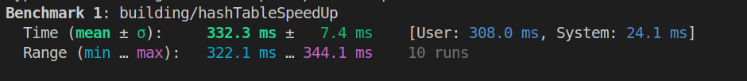
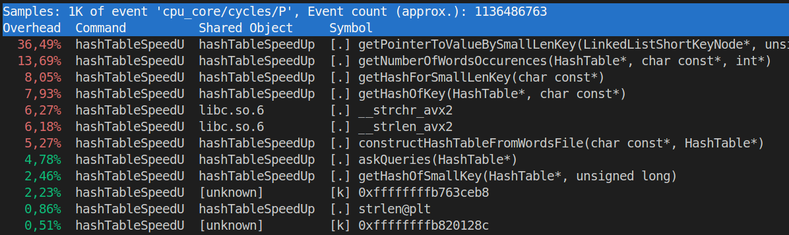
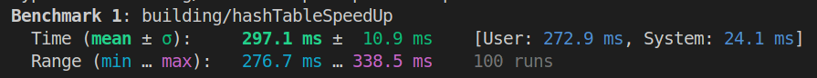
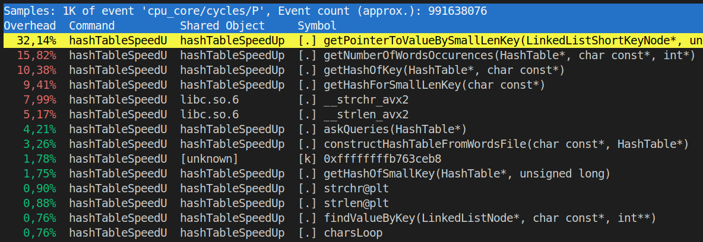

# HashTableSpeedUp

<style type="text/css">
  img {
    background-color: white;
  }
</style>

<h3>1. Annotation</h3>
<hr>

**Goal:** learn how different machine independent optimizations can help in hash table speed up. It's important to say, that we don't want to change initial algorithm, but instead we want to come up with some smart "tricks", that will improve constant factor of our program. To do so, we will create compiler friendly code, so that it can be better optimized by compiler.

<h3>2. Theory</h3>
<hr>

**What's hash table:** it's important to understand how basic [hash tables](https://en.wikipedia.org/wiki/Hash_table) work, in order to improve program's performance significantly. It's a data structure that effectively implements associative array. Of course, we could create an array with size of value of maximum possible key, but that would have required a lot of memory (for example if want to store integers as keys). Instead we will use smarter approach: we can create a function, that takes key as a parameter and returns array index (from 0 to m - 1, where m is hash table array capacity). That way we can store even complex keys (such as strings). However, multiple keys can be pointing to the same array index, that's called a collision. There are various techniques on how to handle them, but we will focus only on [separate chaining collisions handling](https://en.wikipedia.org/wiki/Hash_table#Separate_chaining).

hash table inner structure on simple example:


*image from wikipedia [[1]](https://upload.wikimedia.org/wikipedia/commons/7/7d/Hash_table_3_1_1_0_1_0_0_SP.svg)*

<h3>3. Experiment description</h3>
<hr>
Hash table counts number of occurrences for each word from provided books. Keys are strings and values are integers.

**Note:** all keys should contain only lowercase letters of english alphabet.

**Hash function**: I've used simple [**polynomial hash function**](https://en.wikipedia.org/wiki/Rolling_hash#Polynomial_rolling_hash) with base 31 (prime number, that is larger than number of english letters, which is 26).

</br>
<details>
<summary>Example code of polynomial hash function</summary>

```c++
// HASH_BASE = 31
uint64_t hash = 0;
const char* charPtr = key;
while (*charPtr != '\0') {
    hash *= HASH_BASE;
    hash += *charPtr - 'a' + 1;
    ++charPtr;
}
```
</details>
</br>


**Note:**  This function might not work with words that consist not only from english letters. You might see that we add 1 to hash variable. That's done so that words like *aaaa* and *aaaaaaa* would have different hashes and not just 0.

Hash table methods:
1) insert new key (word). It's actually not present in hash table usecase instead there's only function **constructHashTableFromWordsFile**. But this function is implemented as a "private" method.
2) get value (number of occurrences) for key

**Note:** erase method is not implemented, because we are not using it, but after all changes it should be possible to implement it, so it works in O(1).

There are 2 stages of experiment:
1) Construction of hash table. We read file with words from all books into single buffer. Then we parse keys (words) from this buffer and insert it into hash table
2) Queries. Get number of occurrences for arbitrary word (that can be any word, not necessarily from our base).

<h4>3.1 Used source files (books)</h4>

<h5>3.1.1 sourceFiles inner structure</h5>

All source files are located in **sourceFiles** directory, here's how it looks like:
* **books** - folder with actual texts of listed books
* **words** - folder with files, with words parsed from according books
* **allWords.txt** - words from all books + gibberish words
* **allWordsFromBooks.txt** - self explanatory
* **generateQueries.py** - query is some random word. It can be from some book or it can be randomly generated. Stores result in **queries.txt** file
* **genFileWithRandWords.py** - produces gibberish words to increase number of distinct keys in hash table
* **randWordsFile** - where **genFileWithRandWords.py** script stores result into
* **genFileWithWordsFromBooks.sh** - bash script, uses grep to parse books into words files. Also adds gibberish words.

<h5>3.1.2 List of used books:</h5>

* first 5 books of "Harry Potter".
First 4 books: [github link](https://github.com/amephraim/nlp/blob/master/texts/J.%20K.%20Rowling%20-%20Harry%20Potter%201%20-%20Sorcerer's%20Stone.txt).
* all 3 books of "Lord of the Rings"
* [American version of bible](https://openbible.com/textfiles/asv.txt)
* all [Shakespeare plays](https://gist.githubusercontent.com/s-viour/2b0dce8af13e5ebfba932a266cf3ae55/raw/0432d3d1f0be85334ffc35313c745c2c8b49ffe1/all_shakespeare.txt)

All this books were downloaded for free and I'm not using them for making any money, so I think we're good here.

<h4>3.2 Experiment settings (statistics)</h4>

* Number of words (or number of keys or insertions): 2110109 ($\approx$ 2 million)
* Number of distinct words: $\approx$ 40000
* Number of queries: 4000000 ($\approx$ 4 million)
* "Load factor" for hash table: 200. However it's important to remember that number of insertions (words) is not equal to number of keys we will end up with (distinct words). Number of buckets in hash table is roughly (num of insertions / load factor). Real load factor is: (number of distinct words) / (hash table capacity) $\approx \frac{200000}{2^{14}} \approx 12$.

With such small number of distinct words hash table worked really fast and it was hard to measure execution time. So I've decided to increase that number and add gibberish words.

New number of distinct words: $\approx$ 200000

Capacity for hash table is power of 2. That's done for sake of easier realization. However, it's known that simple hash functions might gain a lot of collisions when hash depends only from *p* lowest bits of a key. But I've run performance tests and that was not the case for me. Execution time even got a bit better, because I've removed slow **%** operation.

<h4>3.3 How to run?</h4>

First you need to choose what version you want to test and switch to according branch (they are described later, in chapter 4).

Make targets:

* **compile**
* **run**
* **compileAndRun** - basically compiles and runs at the same time. First calls **clean** target, than **compile** and **run** targets
* **clean** - clears building directory (where object files are located)
* **testPerformance** - uses **hyperfine** utility, first 3 warm up runs are performed and then 10 actually measured runs are executed
* **runProfiling** - uses **perf** utility, shows which functions are bottleneck

Examples:

* compile program and then run it:

```
make compile
make run
```

* recompile program completely (**building** directory will be removed) and then run it:

```
make compileAndRun
```

* test program performance and then run profiling:

```
make testPerformance
make runProfiling
```

* clean **building** directory (where object files are placed):

```
make clean
```

<h4>3.4 system info</h4>

|                     |                                           |
|:-------------------:|:-----------------------------------------:|
| System              | Ubuntu 22.04 x86_64                       |
| CPU                 | 13th Gen Intel(R) Core(TM) i9-13900H      |
| Compiler            | g++ (Ubuntu 11.4.0-1ubuntu1~22.04) 11.4.0 |
| Optimization flags  | `-Ofast`, `-O3`                           |

<h4>3.5 Measurements and instruments</h4>

<h5>3.5.1 Hyperfine</h5>

For measurements I've used [**hyperfine**](https://github.com/sharkdp/hyperfine?ysclid=m9r8k4lrqk571826338) utility.

Used options:

* **--warmup 3** - 3 executions of program without measuring time, so we don't need to deal with "cold" caches problem.
* **-r 10** - actual number of runs

This tool is very convenient as it also shows dispersion, minimum and maximum of execution times (examples are in 4-th section).

<h5> 3.5.2 Perf </h5>

In order to find bottlenecks in my program (which part or function takes the longest time to compute) I've used [**perf**](https://perfwiki.github.io/main/tutorial/) profiler. That's a really handy tool and here's why:

* there are various commands (however I've used only **record**)
* shows list of functions sorted by percentage of time consumption
* you can click on any function and see it's asm representation. Also at the beginning of every line there's same time consumption percentage (but only for this function and not for the whole program), so you can see more details, such as which asm instruction takes longest time for example

<h3>4. Process of improvement</h3>
<hr>

In this repository there are 3 branches, each branch is one small improvement:

* [master](https://github.com/Kunakbaev/HashTableSpeedUp/tree/master) - the most simple and straightforward approach
* [strcmpImprovement](https://github.com/Kunakbaev/HashTableSpeedUp/tree/strcmpImprovment) - now there are 2 hash tables, usage of strcmp is significantly reduced
* [keySearchInListAndListImprovement](https://github.com/Kunakbaev/HashTableSpeedUp/tree/keySearchInListAndListImprovment) - some kind of unrolling is done, now list node contains more than one key at once
* [asmMyStrcmpFunc](https://github.com/Kunakbaev/HashTableSpeedUp/tree/asmMyStrcmpFunc) - replaced libc **strcmp** function with my own, custom one, written on asm

Let's look at what we are dealing with at first:


As expected main bottleneck is function that searches key in linked list (chain of nodes for hash table cell). And there we actively use **strcmp** function, which is at the top of our "bad functions" list. We need to find a way to get rid of it somehow.

Idea is that most of the words don't have big length (that property however can be spoiled by my gibberish words, so I generated them in such way that their length doesn't exceed 8). So we can make 2 hash tables: one for short words and long words. Let's consider long words those, that have length more than 12. For long words we will use same approach as before and for short ones let's save their polynomial hash instead. As length is <= 12 and we use 26 english letters, all possible short words will have distinct hashes, so no collisions will occur.

**Note:** in hash table for short words we actually use 2 hash functions. First one (**h1**) is to determine hash table cell (chain), where searched word is located. And we use second one (**h2**) to transform word into **uint64_t** number, that's a bijection, so there are no collisions. This number is than searched in linked list, so we don't even need **strcmp** function. **h1** is the same one, that's used in long words hash table. For **h2** I've used simple polynomial hashing algorithm, but without any modulo operations, as words are short and there's no need for them.

Let's apply those changes. Now picture looks like this:


As we can see, we managed to boost our program in **1.32** times (32% improvement).

Main problem is still with the same function, that searches node with needed key, but this time it's not strcmp's fault. Bottleneck is iterating through list (chain). Each time, in order to go next node, we jump to some new region of memory by using pointer. However that prevents compiler from any optimizations, because it simply doesn't know what data will occur in next nodes. Also this approach is not cache friendly

Let's try to save more than one key in node, say 8 (that's a parameter, that's needs to be tweaked to gain maximum boost). This way we will reduce our link jumps and also compiler will be able to process this 8 keys simultaneously as they are independent from each other.

New performance data:


About linked list unrolling: [wikipedia page](http://en.wikipedia.org/wiki/Unrolled_linked_list)


*image from wikipedia article*

As I've already mentioned idea is to save more than one key in node, on this picture there are 4 keys simultaneously in one node.

Works **2.11** times faster than previous approach (111% performance boost) and **2.80** times better than initial design (180% improvement).

If we add -O3 optimization flag (by default all approaches were has been run with -Ofast flag) to file with our bottleneck function, we will se some additional performance improvement.


Works **1.23** times better than without this optimization flag and **3.46** times better than naive approach.

Why did this happen?

Let's use some **perf** functionality to find the reason. We can inspect assembler code for **getPointerToValueBySmallLenKey** (nice naming, yes) function (that's our bottleneck) to see how it differs from previous one. It occurs, that **-O3** managed to unroll loop into 8 operations, so this time comparisons are really happening all at once.

Once again we see that **strcmp** is leading the list of time consuming functions of our program. What can we do about that? Well, libc **strcmp** is too complex, it has to be very safe, work with various input strings (different length for example). But our case is not so general, let's use this to our advantage: we can replace **strcmp** with our own **myStrcmp** function, which will be written on asm and will really light and fast.

Let's implement it and see what will change:





</br>
<details>
<summary>my asm strcmp function code</summary>

```asm

myStrcmp:
    ; loop never reaches ends, because return from function happens earlier
    ; and before that return, rax is always set
    ; mov rax, 0

    xor rcx, rcx
    xor rdx, rdx

    charsLoop:
        mov dl, byte [rdi]
        mov cl, byte [rsi]

        cmp rcx, rdx
        je sameChars
            ; different chars
            mov rax, 0
            ret
        sameChars:

        test rcx, rcx
        je completelyEqual
            ; strings still are equal, continue loop
            inc rdi
            inc rsi
            jmp charsLoop
        completelyEqual:

        ; same chars, but both are equal to \0
        ; strings are completely equal
        mov rax, 1
        ret

    ; this will never be reached, so this is useless command
    ; ret
```
</details>
</br>

We gained a **2.49** boost compared to the previous implementation (and **8.62** times better than initial approach). That's very good (if I'm not mistaken and program still works correctly. Well, I've checked, it appears that it's really started working this much better).

There's even no **myStrcmp** function in list of hottest functions anymore.





</br>
<details>
<summary>key search with simd instructions</summary>

```c++
bool found = false;
for (int i = 0; i < UNROLL_BATCH_SIZE; i += 4) {
    __m256i curNodeKey = _mm256_loadu_si256((__m256i*)(curNode->key + i));
    __m256i cmpResReg  = _mm256_cmpeq_epi64(curNodeKey, searchKeyHashReg);
    
    if (!_mm256_testz_si256(cmpResReg, cmpResReg)) {
        found = true;
        break;
    }
}
if (found) break;
```
</details>
</br>

Let's return back to **getPointerToValueBySmallLenKey** function and try to optimize it a bit more. As we have an array of keys in each node, we can use **SIMD instructions** to process nodes faster. I've changed unrolling batch size (now there are 16 keys stored in node, when previously was only 8) and unrolled loop by 4 iterations. Now we load each 4 continuous hashes in one **__m256i** register and then work with it. By doing those steps I've managed to get an **11%** boost compared to a previous approach.

<h3> 5. Conclusion </h3>
<hr>

Relative speed up column is current version (row) compared to previous one.

Absolute speed up colum is current version (row) compared to initial (naive) one.

| optimization name | performance, ms   | relative speed up | absolute speed up |
|-------------------|---------------|-------------------|-------------------|
| naive approach    | 2900.0 &pm; 300 | 1                 | 1                 |
| 2 hash tables     | 2160 &pm; 40 | 1.32              | 1.32              |
| list unroll       | 1020 &pm; 20 | 2.11              | 2.80              |
| O3 flag           | 830 &pm; 10 | 1.23              | 3.46              |
| my asm strcmp     | 330 &pm; 10  | 2.49              | 8.62              |
| SIMD instructions | 300 &pm; 10 | 1.11              | 9.64              |

Of course it's always possible to rewrite your program with better algorithm. For example for our purpose we can use [ideal hashing](https://en.wikipedia.org/wiki/Perfect_hash_function), as we don't have any deletions and it's worth to try [open addressing collision resolution](https://en.wikipedia.org/wiki/Open_addressing). And that's right thing to do, when you're trying to optimize your program. However, if you don't see any possible improvements in algorithm, than, even with simple knowledge of how compiler works and when it's useful to change function to it's assembler equivalent, you can speed up your program significantly (we've managed to boost it almost 10 times!).

<h3>5. References </h3>

1) [what's hash table?](https://en.wikipedia.org/wiki/Hash_table)
2) [perfect hashing](https://en.wikipedia.org/wiki/Perfect_hash_function)
3) [open addressing](https://en.wikipedia.org/wiki/Open_addressing)
4) [perf profiler](https://perfwiki.github.io/main/tutorial/)
5) [hyperfine utility](https://github.com/sharkdp/hyperfine?ysclid=m9r8k4lrqk571826338)
6) [unrolled linked list](http://en.wikipedia.org/wiki/Unrolled_linked_list)
7) [intel intrinsics guide mirror](https://www.laruence.com/sse/#techs=AVX2)
