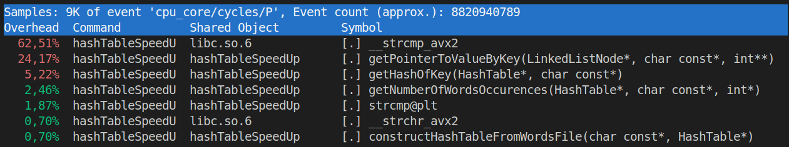

# HashTableSpeedUp

<h3>Basic project description</h3>

In this project, my goal was to optimize hash table with chaining approach. What task are we dealing with? There are books (Lord of the rings, Harry Potter (first 5), American version of bible and all shakespeare plays), to which I added gibberish random words in order to increase number of distinct words. We need to count for each word how many times it appears.

In this repository there are 3 branches:

* master - the most simple and straightforward approach
* strcmpImprovement - now there are 2 hash tables, usage of strcmp is significantly reduced
* keySearchInListAndListImprovement - some kind of unrolling is done, now list node contains more than one key at once

<h3>How hash table is actually used?</h3>

First we load all the words to the hash table, one by one, if words doesn't exist we create new key in table, otherwise we just increase number of occurrences. Then, a series of queries is performed: how many times some word appears in our base (zero if it doesn't).

Some additional info:
* Number of words: 2110109 ($\approx$ 2 million)
* Number of distinct words: 213067 ($\approx$ 200 thousands)
* Number of queries: 4000000 ($\approx$ 4 million)
* Load factor for hash table: 200. However it's important to remember that number of insertions (words) is not equal to number of keys we will end up with (distinct words). Number of buckets in hash table is roughly num of words / load factor.

<h3>How to run?</h3>

First you need to choose what version you want to test and switch to according branch.

Make targets:

* **compile**
* **run**
* **compileAndRun** - basically compiles and runs at the same time. First calls **clean** target, than **compile** and **run** targets
* **clean** - clears building directory (where object files are located)
* **testPerformance** - uses **hyperfine** utility, first 3 warm up runs are performed and then 10 actually measured runs are executed
* **runProfiling** - uses **perf** utility, shows which functions are bottleneck

**sourceFiles** dir:
* books - original books
* words - words parsed from books
* generateQueries - generates 4e6 queries, each randomly chooses whether to take word from list of existing words or to generate random
* genFileWithRandWords - is used to add gibberish words to base and increase number of distinct words, so that life for our hash table wouldn't be so easy.

**genFileWithWordsFromBooks.sh** - bash script, generates final file (base) with all words from books plus gibberish words

<h3>Process of improvement</h3>

Let's look what we are dealing with at first:

As expected main bottleneck is function that searches key in linked list (chain of nodes for hash table cell). And there we actively use **strcmp** function, which is at the top of our "bad functions" list. We need to find a way to get rid of it somehow.

Idea is that most of the words don't have big length (that property however can be spoiled by my gibberish words, so I generated them in such way that their length doesn't exceed 8). So we can make 2 hash tables: one for short words and long words. Let's consider long words those, that have length more than 12. For long words we will use same approach as before and for short ones let's save their polynomial hash instead. As length is <= 12 and we use 26 english letters, all possible short words will have distinct hashes, so no collisions will occur.

Let's apply those changes. Now picture looks like this:

As we can see, we managed to boost our program in **1.32** times (32% improvement).

Main problem is still with the same function, that searches node with needed key, but this time it's not strcmp's fault. Bottleneck is iterating through list (chain). Each time, in order to go next node, we jump to some new region of memory by using pointer. However that prevents compiler from any optimizations, because it simply doesn't know what data will occur in next nodes. Also this approach is not cache friendly

Let's try to save more than one key in node, say 8 (that's a parameter, that's needs to be tweaked to gain maximum boost). This way we will reduce our link jumps and also compiler will be able to process this 8 keys simultaneously as they are independent from each other.

New performance data:

Works **2.11** times faster than previous approach (111% performance boost) and **2.80** times better than initial design (180% improvement).

If we add -O3 optimization flag (by default all approaches were has been run with -Ofast flag) to file with our bottleneck function, we will se some additional performance improvement.

Works **1.23** times better than without this optimization flag and **3.46** times better than naive approach.

Why did this happen?

Let's use some **perf** functionality to find the reason. We can inspect assembler code for **getPointerToValueBySmallLenKey** (nice naming, yes) function (that's our bottleneck) to see how it differs from previous one. It occurs, that **-O3** managed to unroll loop into 8 operations, so this time comparisons are really happening all at once.
